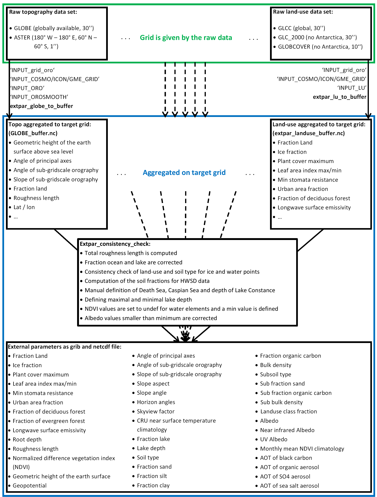

# Software modules {#Software_modules}

## Overview {#Overview}

The software EXTPAR is composed of thirteen autonomous programmes.
Twelve programmes are responsible for aggregating a raw data to the
target grid, which is specified by the user. The thirteenth program, the
consistency check, is performed in the end. The executables are called
`extpar_*_to_buffer`, whereas the star `*` stands for ahf
(anthropogenic heat flux), aot (aerosol optical thickness), cru
(temperature climatology of the Climate Research Unit (CRU)), landuse,
topo, ndvi (normalized difference vegetation index), soil, flake
(fraction lake), isa (impervious surface area), albedo, emiss
(emissivity) and era (ERA climatologies) respectively.
In [Fig. 1](#fig:EXTPAR_Figure) a schematic representation of EXTPAR is
drawn. For the sake of clarity only the topography and land-use path is
shown. The same can be applied for the other ten raw data sets. For all
these programs there exist namelists. Most of the namelists only contain
the name and path of the raw data file and the name of the buffer file,
which is later used for the consistency check, and the name of the
output of the final external variables.

The software modules read from the following namelist files:

-   INPUT_AOT
-   INPUT_LU
-   INPUT_ORO, INPUT_OROSMOOTH, INPUT_RADTOPO, INPUT_SCALE_SEP
-   INPUT_SOIL
-   INPUT_hwsdART
-   INPUT_FLAKE
-   INPUT_grid_org
-   INPUT_COSMO_GRID or INPUT_ICON_GRID
-   namelist.py

The namelists `INPUT_grid_org` and either `INPUT_COSMO_GRID` or
`INPUT_ICON_GRID` are used in all the programs, as they contain the
general information of the target grid to which the raw data should be
aggregated. The namelist file `namelist.py` is read by all Python
programmes.

 

*Figure 1: Schematic illustration of the software EXTPAR.*

## Hybrid Python-CDO structure {#Python-CDO}

For three of the external parameters calculated by EXTPAR, namely
albedo, NDVI, and the Hadley CRU climatologies, problems appeared with
target resolutions much higher than the provided input data set
resolutions. The problem is that not all target grid points get assigned
a proper value when using the legacy Fortan code and interpolation
method.

The algorithm used in the legacy Fortran modules aggregates source grid
point values onto the target grid where the input data is finer than the
target grid and uses bi-linear interpolation to fill the remaining grid
points where the input data is sparser than the target grid. However,
starting from a 5 km global resolution for the target grid, points can
potentially get assigned unreasonable values because of the
insufficiency of the bi-linear interpolation algorithm.

To resolve this issue, for Extpar Version 5.4 a rewrite of those Fortran
modules in Python, using the more sophisticated interpolation methods
from CDO with support for all grids was conducted. Because the
interpolation methods implemented in CDO are faster than those in
Fortran for large model grids, *emiss_to_buffer* is written in Python
as well. A rewrite in Python only makes sense for Fortran modules that
do simple calculations with the data. These calculations can easily be
substituted with CDO-commands in the Python modules. For modules doing
complex calculations and providing many namelist parameters the user can
define, like *extpar_topo_to_buffer* or
*extpar_landuse_to_buffer*, a rewrite in Python is not planned.

The interpolation algorithms selected are:

-   **albedo** *distance-weighted average remapping*
-   **NDVI** *first order conservative remapping*
-   **EDGAR** *first order conservative remapping*
-   **CDNC** *first order conservative remapping*
-   **CRU climatology** *distance-weighted average remapping*
-   **emissivity** *first order conservative remapping*
-   **ERA climatology** *first order conservative remapping*
-   **AHF/ISA** *bilinear interpolation*

The description of the used algorithms can be found via the CDO
documentation:\
(https://code.mpimet.mpg.de/projects/cdo/embedded/cdo.pdf).\

## Summary {#Summary}

The external parameters can be generated by using thirteen programs to
aggregate the various raw datasets to the target grid and after this by
calling the final program for the important consistency check.

1.  In a first step, the target grid and other parameters have to be
    specified by the user in the runscript (see section
    [Grid Definition](./user_manual_06_namelist_input.md#namelist_input_for_extpar_grid_def) for the details).

2.  Then the aggregation of the raw datasets listed in [table 1](./user_manual_01_overall_description.md#input_raw_data) to the given target grid can be
    performed by calling following executables

    -   extpar_aot_to_buffer
    -   extpar_cru_to_buffer
    -   extpar_landuse_to_buffer
    -   extpar_topo_to_buffer
    -   extpar_ndvi_to_buffer
    -   extpar_soil_to_buffer
    -   extpar_flake_to_buffer
    -   extpar_alb_to_buffer
    -   extpar_isa_to_buffer
    -   extpar_ahf_to_buffer
    -   extpar_emiss_to_buffer
    -   extpar_hwsdART_to_buffer
    -   extpar_era_to_buffer
    -   extpar_edgar_to_buffer

    These programs generate intermediate NetCDF files ("buffer") with
    the aggregated data.

3.  The executable

    -   extpar_consistency_check

    reads in the buffer-files, performs an automated consistency check,
    and finally generates the output fields listed in
    [table 2](./user_manual_01_overall_description.md#extpar_output).

The task of the consistency check that is performed at the end is to
find inconsistencies in the soil data, the lake data and the NDVI data.
In the soil data problems may appear between the soil type and the
land-use, in particular for water and ice grid elements. For the
fraction lake, minimal and maximal lake depth must be introduced and
some seas such as the Caspian and the Dead Sea as well as Lake Constance
must be defined manually. For more information see chapter
[3.7](./user_manual_03_fortran_modules.md#extpar_consistency_check).